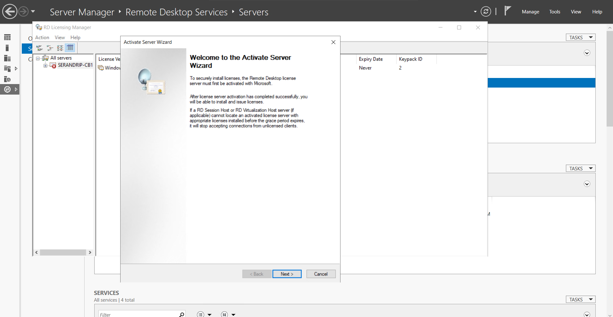

# Remote Desktop Services (RDS) Setup
Remote Desktop Services let you deliver virtualized applications and provide secure remote and mobile desktop access through remote desktop sessions.

### Objective
Setup the platform to deliver individual virtualized applications, providing secure mobile and remote desktop access, and providing end users the ability to run their applications and desktops from the cloud.

- Setup 3 VM Instances for
  - RD Connection Broker
  - RD Web Access & Gateway Server
  - RD Session Host
  - Domain Controller

### Tools & Technologies Used

- Azure VM's
- Azure Virtual Networks
- Load Balancers
- Domain Controller
- Active Directory

### Usefull Links
- https://learn.microsoft.com/en-us/windows-server/remote/remote-desktop-services/create-virtual-machines-for-remote-desktop
- https://learn.microsoft.com/en-us/windows-server/remote/remote-desktop-services/rds-deploy-infrastructure
- https://learn.microsoft.com/en-us/windows-server/remote/remote-desktop-services/rds-create-collection

## Step by Step Implementation

### Setting-up
1. Created 3 Instances of VM's with the same Hardware setup, Resource Group and under the same virtual network

2. Create and attach an Azure data disk for the user profile disk (UPD) share

3. Create an external load balancer to access the deployment externally

4. Configure the external load balancer for your deployment
5. Enter an external URL/DNS name for your deployment to access it externally

### Server config
1. setup the DC server and all the other VM instances to the same domain service
2. Add all the servers you're going to use for Remote Desktop Services to Server Manager
3. Create a session-based deployment to deploy the Remote Desktop Services components

4. Add RD License Server

5. Activate the RD License Server and add it to the License Servers group
6. Add the RD Gateway server and certificate name
7. Create and install self-signed certificates for the RD Gateway and RD Connection Broker servers.
8. Configure the RD Gateway and RD Licensing deployment properties
9.  Create a session collection. These steps create a basic collection.
10.  Get Users to access the RDS collection :D

### Outcome / Result
- Created an enviorenment, where any remote user can log-in to a remote desktop/app configured by the admin with domain credentials
